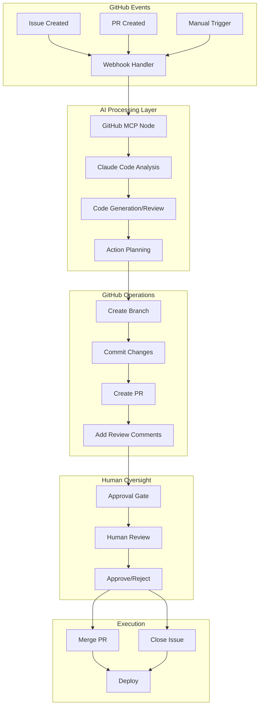

# 🚀 GitHub MCP Integration - Automated Development Workflow

A sophisticated AI-driven development workflow system that integrates Claude Code with GitHub through MCP (Model Context Protocol) to enable automated code generation, review, and repository management with human oversight.

## 🏗️ Architecture Overview

### System Components



### Core Features

#### 🤖 **AI-Driven Workflows**
- **Issue-to-Implementation**: Automatically analyze GitHub issues and generate complete implementations
- **Automated Code Review**: Claude-powered code quality, security, and performance analysis
- **Bug Fix Generation**: Root cause analysis and surgical fix implementation
- **Documentation Creation**: Comprehensive code and API documentation generation
- **Refactoring Assistance**: Code quality improvements following SOLID principles

#### 🔒 **Human Oversight & Approval Gates**
- **Implementation Plan Review**: Human approval before code generation
- **Code Review Gate**: Manual review of generated code changes
- **Merge Approval**: Final human approval before merging changes
- **Audit Trail**: Complete workflow execution history and decision tracking

#### 🔧 **GitHub MCP Operations**
- List and browse repositories
- Get repository content and structure
- Create branches and manage Git operations
- Commit changes with proper messaging
- Create and manage pull requests
- Issue tracking and management
- Automated code reviews with feedback

## 📁 Project Structure

```
backend/app/
├── models/
│   └── github_mcp_models.py          # Pydantic models for GitHub operations
├── services/
│   ├── github_mcp_service.py          # Core GitHub API integration
│   └── github_workflow_orchestrator.py # AI workflow coordination
├── routes/
│   └── github_mcp.py                  # REST API endpoints
└── templates/
    └── claude_github_prompts.py       # Claude AI prompt templates

frontend/src/components/nodes/
└── GitHubMCPNode.tsx                  # React Flow visual component
```

## 🚀 Quick Start Guide

### 1. Prerequisites

```bash
# Backend dependencies
pip install aiohttp fastapi pydantic

# API Keys Required
- GitHub Personal Access Token
- Claude API Key (Anthropic)
```

### 2. Configuration

```bash
# Set up API keys in the backend
POST /api/api-keys
{
  "name": "github",
  "key": "ghp_your_github_token",
  "provider": "github"
}

POST /api/api-keys
{
  "name": "claude",
  "key": "sk-ant-your_claude_key",
  "provider": "anthropic"
}
```

### 3. Start the Services

```bash
# Backend (runs on :8000)
cd backend
python -m app.main

# Frontend (runs on :8082)
npm run dev
```

## 📖 Usage Examples

### Issue-to-PR Workflow

```bash
# Start automated implementation workflow
POST /api/github-mcp/workflows/issue-to-pr
{
  "owner": "microsoft",
  "repo": "vscode",
  "issue_number": 123
}

# Response
{
  "success": true,
  "workflow_id": "issue-123-a1b2c3d4",
  "status": "analyzing"
}
```

### Automated Code Review

```bash
# Start code review workflow
POST /api/github-mcp/workflows/code-review
{
  "owner": "microsoft",
  "repo": "vscode", 
  "pull_number": 456
}

# Response
{
  "success": true,
  "workflow_id": "review-456-e5f6g7h8",
  "status": "reviewing"
}
```

### Workflow Management

```bash
# Check workflow status
GET /api/github-mcp/workflows/issue-123-a1b2c3d4

# Approve implementation plan
POST /api/github-mcp/workflows/issue-123-a1b2c3d4/approve
{
  "approved": true,
  "reviewer": "john.doe@company.com",
  "notes": "Implementation plan looks good, proceed with coding"
}

# List active workflows
GET /api/github-mcp/workflows
```

## 🔄 Workflow Details

### Issue-to-Implementation Workflow

1. **Analysis Phase**
   - Fetch issue details from GitHub
   - Analyze repository structure and existing code
   - Claude generates implementation plan
   - **[APPROVAL GATE]** Human reviews implementation plan

2. **Implementation Phase** (if approved)
   - Create feature branch
   - Generate code files following SOLID principles
   - Write comprehensive tests
   - Commit changes with proper messages
   - Create draft pull request

3. **Review Phase**
   - **[APPROVAL GATE]** Human code review
   - Address feedback if needed
   - Ready for merge when approved

### Code Review Workflow

1. **Analysis**
   - Fetch PR diff and metadata
   - Claude analyzes code changes
   - Check SOLID principles compliance
   - Security vulnerability assessment
   - Performance impact analysis

2. **Review Generation**
   - Generate detailed review comments
   - Provide improvement suggestions
   - Assign severity levels to issues
   - Recommend approval/rejection

3. **Human Validation**
   - Present AI review to human reviewer
   - Human makes final approval decision
   - Merge or request changes

## 🎨 Visual Workflow Editor

### GitHub MCP Node Component

The React Flow node provides a visual interface for:

- **Configuration Tab**: Set up GitHub operations and repository details
- **Parameters Tab**: Configure operation-specific parameters
- **Results Tab**: View execution results and output data

```typescript
// Example usage in React Flow
<GitHubMCPNode
  data={{
    operation: "create_pull_request",
    config: {
      owner: "microsoft",
      repo: "vscode",
      apiKeyName: "github"
    },
    params: {
      title: "Feature: Add new functionality",
      body: "Detailed PR description",
      head: "feature/new-functionality",
      base: "main"
    }
  }}
/>
```

## 🔧 API Reference

### Core GitHub Operations

| Endpoint | Method | Description |
|----------|--------|-------------|
| `/api/github-mcp/repositories` | POST | List user repositories |
| `/api/github-mcp/repositories/content` | POST | Get repository content |
| `/api/github-mcp/repositories/branches` | POST | Create new branch |
| `/api/github-mcp/repositories/commits` | POST | Commit changes |
| `/api/github-mcp/pull-requests` | POST | Create pull request |
| `/api/github-mcp/issues` | POST | Create issue |

### Workflow Operations

| Endpoint | Method | Description |
|----------|--------|-------------|
| `/api/github-mcp/workflows/issue-to-pr` | POST | Start issue implementation |
| `/api/github-mcp/workflows/code-review` | POST | Start code review |
| `/api/github-mcp/workflows` | GET | List active workflows |
| `/api/github-mcp/workflows/{id}` | GET | Get workflow status |
| `/api/github-mcp/workflows/{id}/approve` | POST | Approve workflow step |

### MCP Tools for Claude

| Tool | Description | Parameters |
|------|-------------|------------|
| `list_repositories` | List user repositories | visibility, sort, direction |
| `get_repository_content` | Get file/directory content | owner, repo, path, ref |
| `create_branch` | Create new branch | owner, repo, branch_name, base_branch |
| `commit_changes` | Commit file changes | owner, repo, branch, message, files |
| `create_pull_request` | Create pull request | owner, repo, title, body, head, base |

## 🔐 Security Considerations

### Authentication & Authorization
- GitHub Personal Access Tokens with minimal required permissions
- API key rotation and secure storage
- Repository access scoping and validation

### Code Safety
- All generated code goes through human review
- Draft PRs created by default for safety
- Approval gates prevent unauthorized changes
- Complete audit trail of all operations

### Data Protection
- No sensitive data stored in AI prompts
- Repository content only accessed as needed
- Secure handling of API keys and tokens

## 📊 Monitoring & Observability

### Workflow Metrics
- Workflow execution times and success rates
- Human approval rates and feedback
- Code quality improvements over time
- Developer productivity gains

### Health Checks
```bash
GET /api/github-mcp/health
{
  "status": "healthy",
  "tools_available": 8,
  "active_workflows": 3,
  "features": ["Repository operations", "AI workflows", "Human oversight"]
}
```

### Logging
- Comprehensive workflow execution logs
- GitHub API interaction tracking
- Claude AI usage and performance metrics
- Human approval decision audit trail

## 🔮 Advanced Features

### Custom Workflow Types
- **Security Audit**: Automated security vulnerability scanning
- **Performance Optimization**: Code performance analysis and improvements
- **Documentation Generation**: Comprehensive API and code documentation
- **Dependency Updates**: Automated dependency management and updates

### Integration Capabilities
- **CI/CD Pipeline Integration**: Trigger workflows from build events
- **Slack/Teams Notifications**: Real-time workflow status updates
- **Jira Integration**: Link workflows to project management tickets
- **Code Quality Gates**: Integration with SonarQube, CodeClimate

### Scaling Considerations
- **Multi-Repository Support**: Manage workflows across multiple repos
- **Team Collaboration**: Multiple reviewers and approval workflows
- **Batch Operations**: Process multiple issues/PRs simultaneously
- **Performance Optimization**: Caching and rate limiting

## 🚨 Troubleshooting

### Common Issues

**GitHub Authentication Errors**
```bash
# Check API key validity
GET /api/github-mcp/repositories
# Verify token permissions in GitHub settings
```

**Claude API Failures**
```bash
# Check Claude API key
# Verify rate limits and usage
# Review prompt structure and length
```

**Workflow Stuck in Approval**
```bash
# Check workflow status
GET /api/github-mcp/workflows/{workflow_id}
# Manually approve or reject
POST /api/github-mcp/workflows/{workflow_id}/approve
```

### Performance Optimization
- Use repository caching for large codebases
- Implement rate limiting for GitHub API calls
- Optimize Claude prompts for faster response times
- Batch similar operations when possible

## 🤝 Contributing

### Development Workflow
1. Create feature branch for new capabilities
2. Implement backend service and models
3. Add comprehensive tests
4. Create/update React components
5. Update documentation
6. Submit PR with human review

### Code Standards
- Follow SOLID principles
- Comprehensive error handling
- Security-first implementation
- Clear documentation and comments
- Full test coverage

## 📄 License

This project is part of the AgentOps Flow Forge system and follows the same licensing terms.

---

## 🎯 Next Steps

1. **Enhanced AI Capabilities**: More sophisticated code analysis and generation
2. **Advanced Approval Workflows**: Multi-stage approval processes
3. **Repository Templates**: Pre-configured workflows for common project types
4. **Performance Analytics**: Detailed metrics and optimization recommendations
5. **Enterprise Features**: Advanced security, compliance, and governance features

This GitHub MCP integration represents a significant step toward fully automated, AI-driven development workflows while maintaining the essential human oversight needed for production systems. 